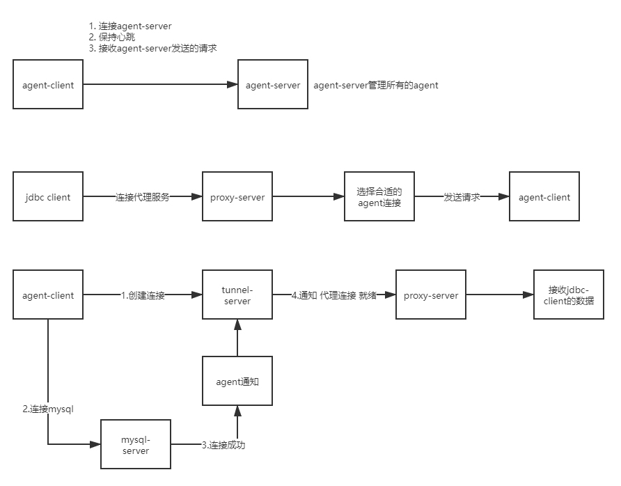

# jaspercloud-tcp-proxy-link
基于netty的内网穿透通信

## 项目用于外网没有固定ip，或是公司安全只能内网向外网发起连接。

## 项目一共分为两个部分
一、代理服务端

1.agent-server接收agent-client的请求和管理agnet-client

2.proxy-server接收外网的连接

3.tunnel-server接收agent创建的代理通信和外网的数据通信

二、代理客户端

1.agent-client连接agent-server和保持心跳

## 流程图

## 目录结构

tcp-proxy-link-server: 部署在服务器上，和agent、client通信

tcp-proxy-link-agent: 部署在需要穿透的机器或网关机器上

tcp-proxy-link-client: 本机运行配置要连接的机器内网地址、端口，和本机代理端口
