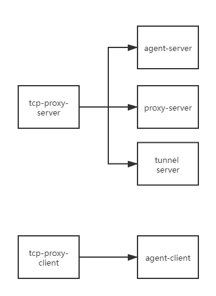

# jaspercloud-tcp-proxy-link
tcp-proxy-link

## 项目用于外网没有固定ip，或是公司安全只能内网向外网发起连接。

## 项目一共分为两个部分
一、代理服务端

1.agent-server接收agent-client的请求和管理agnet-client

2.proxy-server接收外网的连接

3.tunnel-server接收agent创建的代理通信和外网的数据通信

二、代理客户端

1.agent-client连接agent-server和保持心跳

## 流程图

